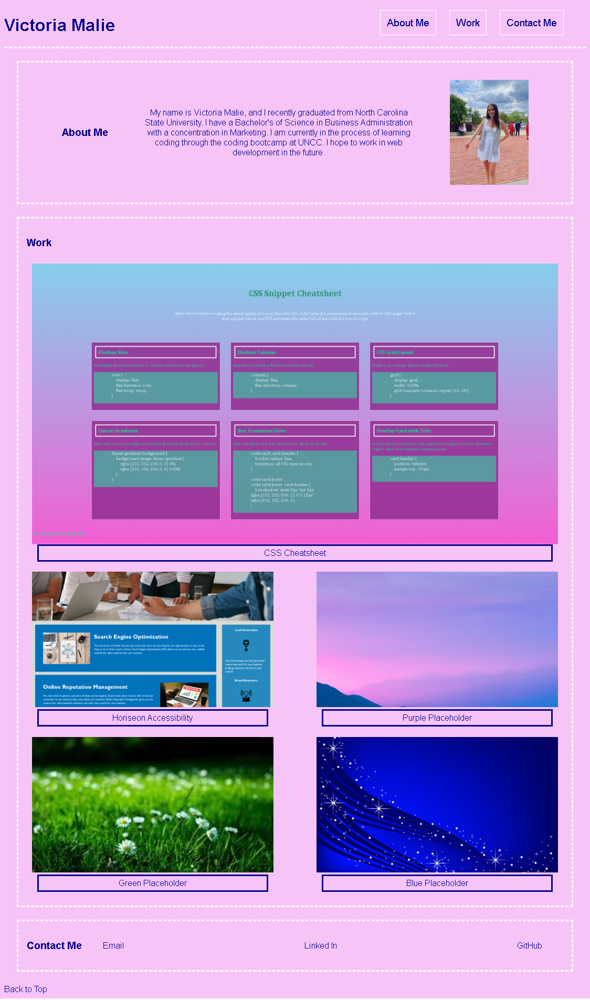

# Portfolio

## Table of Contents
1. [Description](#description)
2. [Visuals](#visuals)
3. [Resources](#resources)

## Description

I've attempted to create a Portfolio website. I have a navigation bar for the about me, work, and contact me sections, along with a fooder link that will return to the top of the page. I included a picture and short about me paragraph. 

I included images of past work along with place holder images with captions and links (one functional, some placeholder). I'm having a lot of trouble figuring out flex box and have made a tutoring appointment to help me improve the styling and layout of this website.

At the bottom, I included a contact me section with links to my email, LinkedIn and GitHub.

## Visuals

## Resources

[Live Site](https://vmalie3.github.io/portfolio/)

[Repository](https://github.com/vmalie3/portfolio)